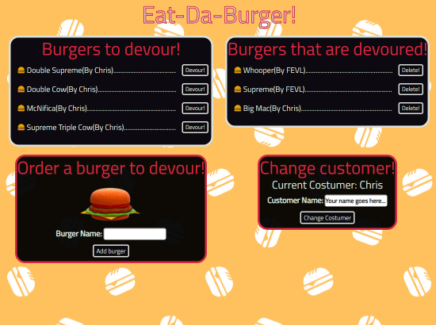

# **Eat-Da-Burger 2.0!**

## Description  
Burger logger with Sequelize, Node, Express & Handlebars. 
Add a burger to the DB, Devour it! and clean your table whenever you want...
***

***
## Libraries
   * [Express](https://www.npmjs.com/package/express)
   * [Express Handlebars](https://www.npmjs.com/package/express-handlebars)
   * [Sequelize](https://www.npmjs.com/package/sequelize)
   * [jQuery](https://jquery.com/)
   * [Bootstrap](https://getbootstrap.com/)

***
## **Give it a try**
* ### [Try it here!](https://fevl-burger-sequelize.herokuapp.com/)
